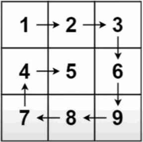

# Question
Print all elements of a 2D matrix in spiral format

**Example:**

[]

**Output**

1 2 3 6 9 8 7 4 5

# Answer
### method 1
```python
def spiral(arr):
    row, column = len(arr), len(arr[0])
    left = up = 0
    right = column-1
    down = row-1
    total = row*column
    v = 0

    while v < total:
        for i in range(left,right+1):
            print(arr[up][i], end=" ")
            v += 1
        up += 1
        if v==total:break

        for i in range(up,down+1):
            print(arr[i][right], end=" ")
            v += 1
        right -= 1
        if v==total:break

        for i in range(right,left-1,-1):
            print(arr[down][i], end=" ")
            v += 1
        down -= 1
        if v==total:break

        for i in range(down,up-1,-1):
            print(arr[i][left], end=" ")
            v += 1
        left += 1
        if v==total:break

```
