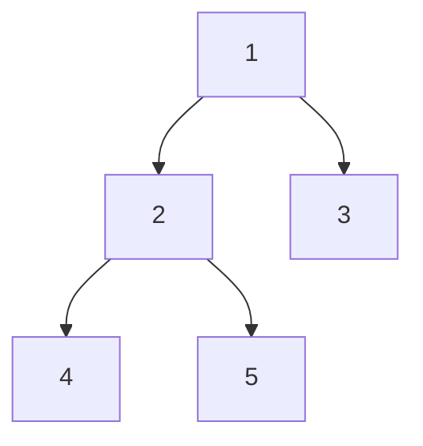

# Tree Traversals


- **Inorder (Left, Root, Right) : 4 2 5 1 3**
- **Preorder (Root, Left, Right) : 1 2 4 5 3** 
- **Postorder (Left, Right, Root) : 4 5 2 3 1**

### In Order
```python
def inorder(node, result=None):
    if result is None:
        result = []
    if not node:
        return
    inorder(node.leftChild, result)
    result.append(node.value)
    inorder(node.rightChild, result)
    return result


```

### Pre Order
```python
def preorder(node, result=None):
    if result is None:
        result = []
    if not node:
        return
    result.append(node.value)
    preorder(node.leftChild, result)
    preorder(node.rightChild, result)
    return result
```

### Post Order
```python
def postorder(node, result=None):
    if result is None:
        result = []
    if not node:
        return
    postorder(node.leftChild, result)
    postorder(node.rightChild, result)
    result.append(node.value)
    return result
```