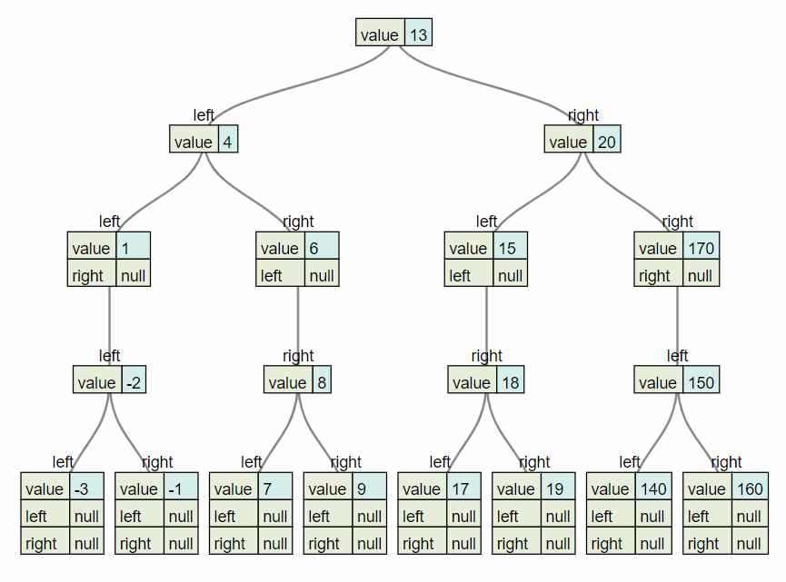
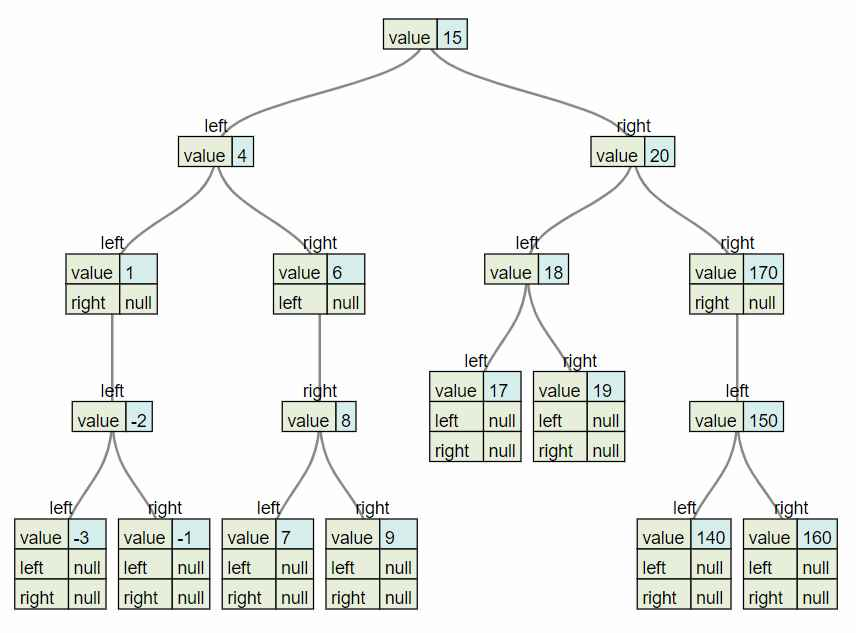

# Binary Search Tree

### Javascript
```javascript
class Node {
  constructor(value){
    this.left = null;
    this.right = null;
    this.value = value;
  }
}

class BinarySearchTree {
  constructor(){
    this.root = null;
  }
  insert(value){
    const node = new Node(value);
    if(!this.root){
      this.root = node;
      return this
    }
    let current_node = this.root;
    while(true){
      if(current_node.value > value){
        if(!current_node.left){
          current_node.left = node;
          return this
        }
        current_node = current_node.left;
      } else {
        if(!current_node.right){
          current_node.right = node;
          return this
        }
        current_node = current_node.right;
      }
    }
  }
  lookup(value){
    let current_node = this.root;
    while(current_node){
      if(current_node.value > value){
        current_node = current_node.left;
      } else if(current_node.value < value){
        current_node = current_node.right;
      } else if (current_node.value === value){
        return current_node
      }
    }
    return null
  }
  
  successor(node){
    node = node.right;
    while(node.left){
      node = node.left;
    }
    return node
  }

  remove(value){
    //no node
    if(!this.root){
      return null
    }
    let current = this.root;
    let parent = null;
    while(current){
      //finding the node to delete
      if(current.value < value){
        parent = current;
        current = current.right;
      } else if (current.value > value) {
        parent = current;
        current = current.left;
      //after finding node
      } else if(current.value === value) {
        //node with no children
        if(!current.left && !current.right){
          //root node
          if(this.root === current){
            this.root = null;
          } else {
            parent.left === current ? parent.left = null
                                    : parent.right = null;
          }
        //node with two children
        } else if (current.left && current.right){
          let successor = this.successor(current);
          //successor always be a leaf or a node with empty right child
          this.remove(successor.value);
          successor.right = current.right;
          successor.left = current.left;
          if(this.root === current){
           this.root = successor; 
          } else {
            parent.left === current ? parent.left = successor
                                    : parent.right = successor;
          }
        } else if(current.left){
          //root node
          if(this.root === current){
            this.root = current.left;
          } else {
            parent.left === current ? parent.left = current.left 
                                    : parent.right = current.left;
          }
        } else {
          //root noode
          if(this.root === current){
            this.root = current.right;
          } else {
            parent.right === current ? parent.right = current.right
                                     : parent.left = current.right;
          }
       } 
        return current;
     }
    }
  }
}

```

#### Testing
```javascript
function traverse(node) {
  const tree = { value: node.value };
  tree.left = node.left === null ? null : traverse(node.left);
  tree.right = node.right === null ? null : traverse(node.right);
  return tree;
}

function test(){
  console.log(JSON.stringify(traverse(tree.root)));
}

const tree = new BinarySearchTree();
tree.insert(13);
tree.insert(4);
tree.insert(6);
tree.insert(20);
tree.insert(170);
tree.insert(15);
tree.insert(1);
tree.insert(8);
tree.insert(7);
tree.insert(18);
tree.insert(17);
tree.insert(19);
tree.insert(150);
tree.insert(160);
tree.insert(140);
tree.insert(9);
tree.insert(-2);
tree.insert(-3);
tree.insert(-1);
test()

```
##### Output
```json
{"value":13,"left":{"value":4,"left":{"value":1,"left":{"value":-2,"left":{"value":-3,"left":null,"right":null},"right":{"value":-1,"left":null,"right":null}},"right":null},"right":{"value":6,"left":null,"right":{"value":8,"left":{"value":7,"left":null,"right":null},"right":{"value":9,"left":null,"right":null}}}},"right":{"value":20,"left":{"value":15,"left":null,"right":{"value":18,"left":{"value":17,"left":null,"right":null},"right":{"value":19,"left":null,"right":null}}},"right":{"value":170,"left":{"value":150,"left":{"value":140,"left":null,"right":null},"right":{"value":160,"left":null,"right":null}},"right":null}}}
```

**Use this [Website](https://vanya.jp.net/vtree/ "Json to Tree Diagram") to view the json as a tree diagram**


### Python
```python
import json
class Node:
    def __init__(self, value, parent=None):
        self.value = value
        self.leftChild = None
        self.rightChild = None
        self.parent = parent

    def hasLeftChild(self):
        return self.leftChild

    def hasRightChild(self):
        return self.rightChild

    def isLeftChild(self):
        return self.parent and self.parent.leftChild == self

    def isRightChild(self):
        return self.parent and self.parent.rightChild == self

    def isRoot(self):
        return not self.parent

    def isLeaf(self):
        return not (self.rightChild or self.leftChild)

    def hasAnyChildren(self):
        return self.rightChild or self.leftChild

    def hasBothChildren(self):
        return self.rightChild and self.leftChild

    def toJson(self):
        json_data = {"value": self.value,
                     "left": self.leftChild.toJson() if self.hasLeftChild() else "null",
                     "right": self.rightChild.toJson() if self.hasRightChild() else "null"}
        return json_data


class BST:
    def __init__(self):
        self.root = None
        self._length = 0

    def __len__(self):
        return self.length

    @property
    def length(self):
        return self._length

    def __contains__(self, value):
        return self.search(value)

    def __bool__(self):
        return True if self.root else False

    def insert(self, value):
        if self.root is None:
            self.root = Node(value)
        else:
            self._insert(value, self.root)
        self._length += 1

    def _insert(self, value, current_root):
        if value == current_root.value:
            raise ValueError('item already present')
        elif value < current_root.value:
            if current_root.hasLeftChild():
                self._insert(value, current_root.leftChild)
            else:
                current_root.leftChild = Node(value, current_root)
        else:
            if current_root.hasRightChild():
                self._insert(value, current_root.rightChild)
            else:
                current_root.rightChild = Node(value, current_root)

    def search(self, value):
        current = self.root
        while current:
            if current.value == value:
                return current
            elif current.value > value:
                current = current.leftChild
            else:
                current = current.rightChild
        return False

    def successor(self, current):
        current = current.rightChild
        while current.leftChild:
            current = current.leftChild
        return current

    def delete(self, value):
        if self.root is None:
            raise IndexError('empty tree')

        self._delete(self.root, value)
        self._length -= 1

    def _delete(self, current, value):
        while current and current.value != value:
            if current.value > value:
                current = current.leftChild
            else:
                current = current.rightChild

        if current is None:
            raise KeyError('key not found')

        #case 1: node is a leaf
        if current.isLeaf():
            if current == self.root:
                self.root = None
            else:
                if current.isLeftChild():
                    current.parent.leftChild = None
                else:
                    current.parent.rightChild = None

        #case 2: node has 2 children
        elif current.hasBothChildren():
            successor = self.successor(current)
            self._delete(successor, successor.value)
            successor.rightChild = current.rightChild
            successor.leftChild = current.leftChild

            if current == self.root:
                self.root = successor
            else:
                if current.isLeftChild():
                    current.parent.leftChild = successor
                else:
                    current.parent.rightChild = successor

            #changing parent of left&right child, if the successor is
            #its right or left child that node will be deleted, so we
            #nedd to check that
            if successor.leftChild:
                successor.leftChild.parent = successor
            if successor.rightChild:
                successor.rightChild.parent = successor
        #case 3: single child
        else:
            if current.hasLeftChild():
                child = current.leftChild
            else:
                child = current.rightChild

            if current == self.root:
                self.root = child
                child.parent = None
            else:
                if current.isLeftChild():
                    current.parent.leftChild = child
                else:
                    current.parent.rightChild = child

                child.parent =current.parent

    def deletebst(self):
        self.root.value = None
        self.root.left = None
        self.root.right = None

    def toJson(self):
        if self.root is None:
            return None
        json_data = {'value':self.root.value,
                     'left': self.root.leftChild.toJson() if self.root.hasLeftChild() else 'null',
                     'right': self.root.rightChild.toJson() if self.root.hasRightChild() else 'null'}
        return json.dumps(json_data)
```
#### Testing
```python
tree = BST()
tree.insert(13)
tree.insert(4)
tree.insert(6)
tree.insert(20)
tree.insert(170)
tree.insert(15)
tree.insert(1)
tree.insert(8)
tree.insert(7)
tree.insert(18)
tree.insert(17)
tree.insert(19)
tree.insert(150)
tree.insert(160)
tree.insert(140)
tree.insert(9)
tree.insert(-2)
tree.insert(-3)
tree.insert(-1)
print(tree.toJson())
tree.delete(13)
print('After Deleting\n'+'-'*10)
print(tree.toJson())

```
##### Output
```json
{"value": 13, "left": {"value": 4, "left": {"value": 1, "left": {"value": -2, "left": {"value": -3, "left": "null", "right": "null"}, "right": {"value": -1, "left": "null", "right": "null"}}, "right": "null"}, "right": {"value": 6, "left": "null", "right": {"value": 8, "left": {"value": 7, "left": "null", "right": "null"}, "right": {"value": 9, "left": "null", "right": "null"}}}}, "right": {"value": 20, "left": {"value": 15, "left": "null", "right": {"value": 18, "left": {"value": 17, "left": "null", "right": "null"}, "right": {"value": 19, "left": "null", "right": "null"}}}, "right": {"value": 170, "left": {"value": 150, "left": {"value": 140, "left": "null", "right": "null"}, "right": {"value": 160, "left": "null", "right": "null"}}, "right": "null"}}}
After Deleting
----------
{"value": 15, "left": {"value": 4, "left": {"value": 1, "left": {"value": -2, "left": {"value": -3, "left": "null", "right": "null"}, "right": {"value": -1, "left": "null", "right": "null"}}, "right": "null"}, "right": {"value": 6, "left": "null", "right": {"value": 8, "left": {"value": 7, "left": "null", "right": "null"}, "right": {"value": 9, "left": "null", "right": "null"}}}}, "right": {"value": 20, "left": {"value": 18, "left": {"value": 17, "left": "null", "right": "null"}, "right": {"value": 19, "left": "null", "right": "null"}}, "right": {"value": 170, "left": {"value": 150, "left": {"value": 140, "left": "null", "right": "null"}, "right": {"value": 160, "left": "null", "right": "null"}}, "right": "null"}}}

```

**Use this [Website](https://vanya.jp.net/vtree/ "Json to Tree Diagram") to view the json as a tree diagram**



#### After Deleting


