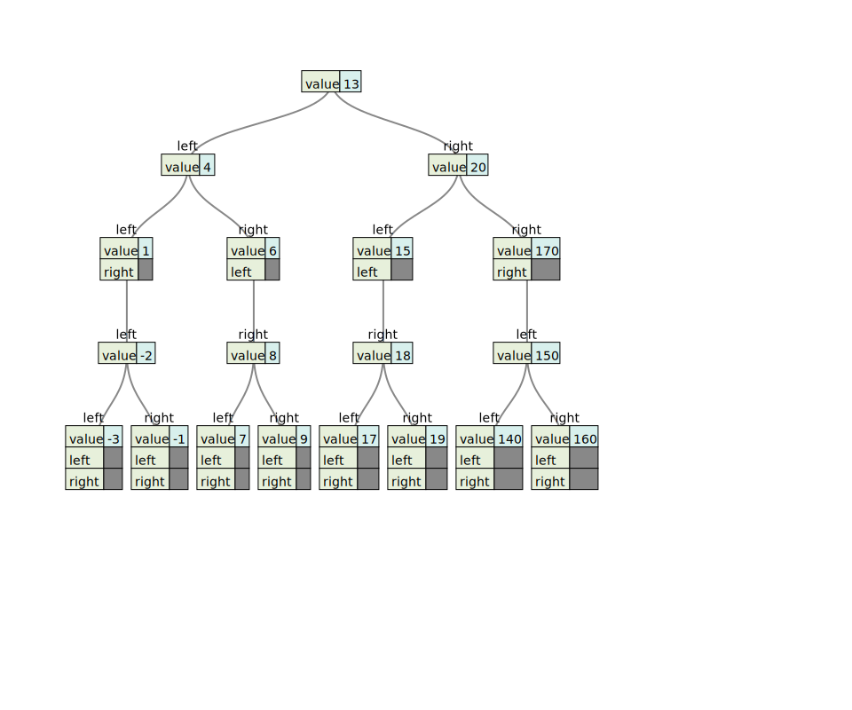

# Binary Search Tree

### Javascript
```javascript
class Node {
  constructor(value){
    this.left = null;
    this.right = null;
    this.value = value;
  }
}

class BinarySearchTree {
  constructor(){
    this.root = null;
  }
  insert(value){
    const node = new Node(value);
    if(!this.root){
      this.root = node;
      return this
    }
    let current_node = this.root;
    while(true){
      if(current_node.value > value){
        if(!current_node.left){
          current_node.left = node;
          return this
        }
        current_node = current_node.left;
      } else {
        if(!current_node.right){
          current_node.right = node;
          return this
        }
        current_node = current_node.right;
      }
    }
  }
  lookup(value){
    let current_node = this.root;
    while(current_node){
      if(current_node.value > value){
        current_node = current_node.left;
      } else if(current_node.value < value){
        current_node = current_node.right;
      } else if (current_node.value === value){
        return current_node
      }
    }
    return null
  }
  
  successor(node){
    node = node.right;
    while(node.left){
      node = node.left;
    }
    return node
  }

  remove(value){
    //no node
    if(!this.root){
      return null
    }
    let current = this.root;
    let parent = null;
    while(current){
      //finding the node to delete
      if(current.value < value){
        parent = current;
        current = current.right;
      } else if (current.value > value) {
        parent = current;
        current = current.left;
      //after finding node
      } else if(current.value === value) {
        //node with no children
        if(!current.left && !current.right){
          //root node
          if(this.root === current){
            this.root = null;
          } else {
            parent.left === current ? parent.left = null
                                    : parent.right = null;
          }
        //node with two children
        } else if (current.left && current.right){
          let successor = this.successor(current);
          //successor always be a leaf or a node with empty right child
          this.remove(successor.value);
          successor.right = current.right;
          successor.left = current.left;
          if(this.root === current){
           this.root = successor; 
          } else {
            parent.left === current ? parent.left = successor
                                    : parent.right = successor;
          }
        } else if(current.left){
          //root node
          if(this.root === current){
            this.root = current.left;
          } else {
            parent.left === current ? parent.left = current.left 
                                    : parent.right = current.left;
          }
        } else {
          //root noode
          if(this.root === current){
            this.root = current.right;
          } else {
            parent.right === current ? parent.right = current.right
                                     : parent.left = current.right;
          }
       } 
        return current;
     }
    }
  }
}

```

#### Testing
```javascript
function traverse(node) {
  const tree = { value: node.value };
  tree.left = node.left === null ? null : traverse(node.left);
  tree.right = node.right === null ? null : traverse(node.right);
  return tree;
}

function test(){
  console.log(JSON.stringify(traverse(tree.root)));
}

const tree = new BinarySearchTree();
tree.insert(13);
tree.insert(4);
tree.insert(6);
tree.insert(20);
tree.insert(170);
tree.insert(15);
tree.insert(1);
tree.insert(8);
tree.insert(7);
tree.insert(18);
tree.insert(17);
tree.insert(19);
tree.insert(150);
tree.insert(160);
tree.insert(140);
tree.insert(9);
tree.insert(-2);
tree.insert(-3);
tree.insert(-1);
test()

```
##### Output
```json
{"value":13,"left":{"value":4,"left":{"value":1,"left":{"value":-2,"left":{"value":-3,"left":null,"right":null},"right":{"value":-1,"left":null,"right":null}},"right":null},"right":{"value":6,"left":null,"right":{"value":8,"left":{"value":7,"left":null,"right":null},"right":{"value":9,"left":null,"right":null}}}},"right":{"value":20,"left":{"value":15,"left":null,"right":{"value":18,"left":{"value":17,"left":null,"right":null},"right":{"value":19,"left":null,"right":null}}},"right":{"value":170,"left":{"value":150,"left":{"value":140,"left":null,"right":null},"right":{"value":160,"left":null,"right":null}},"right":null}}}
```

**Use this [Website](https://vanya.jp.net/vtree/ "Json to Tree Diagram") to view the json as a tree diagram**



### Python
```python
class Node:
    def __init__(self, value):
        self.value = value
        self.left = None
        self.right = None
    
    def isLeaf(self):
        if (not self.left) and (not self.right):
            return True
    
    def isBoth(self):
        if self.left and self.right:
            return True
    
class BST:
    def __init__(self):
        self.root = None
    
    def insert(self, value):
        if self.root is None:
            self.root = Node(value)
        else:
            self._insert(value, self.root)
    
    def _insert(self, value, root):
        if root is None:
            root = Node(value)
        elif value < root.value:
            if root.left is None:
                root.left = Node(value)
            else:
                self._insert(value, root.left)
        else:
            if root.right is None:
                root.right = Node(value)
            else:
                self._insert(value, root.right)
    
    def preorder(self):
        self._preorder(self.root)
    
    def _preorder(self, current):
        if current is None:
            return None
        else:
            print(current.value)
            self._preorder(current.left)
            self._preorder(current.right)
            
    def preorder(self):
        self._preorder(self.root)
    
    def _preorder(self, current):
        if current is None:
            return None
        else:
            print(current.value)
            self._preorder(current.left)
            self._preorder(current.right)
            
    def inorder(self):
        self._inorder(self.root)
    
    def _inorder(self, current):
        if current is None:
            return None
        else:
            self._inorder(current.left)
            print(current.value)
            self._inorder(current.right)
    
    def postorder(self):
        self._postorder(self.root)
    
    def _postorder(self, current):
        if current is None:
            return None
        else:
            self._postorder(current.left)
            self._postorder(current.right)
            print(current.value)
            
    def levelorder(self):
        if self.root is None:
            return None
        q = Queue()
        q.put(self.root)
        while (not q.empty()):
            node = q.get()
            print(node.value)
            if node.left:
                q.put(node.left)
            if node.right:
                q.put(node.right)
        
    def search(self, value):
        current = self.root
        while current:
            if current.value == value:
                return True
            elif current.value > value:
                current = current.left
            else:
                current = current.right
        return False
    
    def successor(self, current):
        current = current.right
        while current.left:
            current = current.left
        return current
    
    def delete(self,value):
        self._delete(self.root, value)
    
    def _delete(self, current, value):
        if current is None:
            return current
        if current.value > value:
            current.left = self._delete(current.left, value)
        elif current.value < value:
            current.right = self._delete(current.right, value)
        else:
            if current.left is None:
                temp = current.right
                current = None
                return temp
            if current.right is None:
                temp = current.left
                current = None
                return temp
            
            temp = self.successor(current).value
            current.value = temp
            current.right = self._delete(current.right, temp)
        
        return current
    
    def deletebst(self):
        self.root.value = None
		self.root.left = None
		self.root.right = None
```
