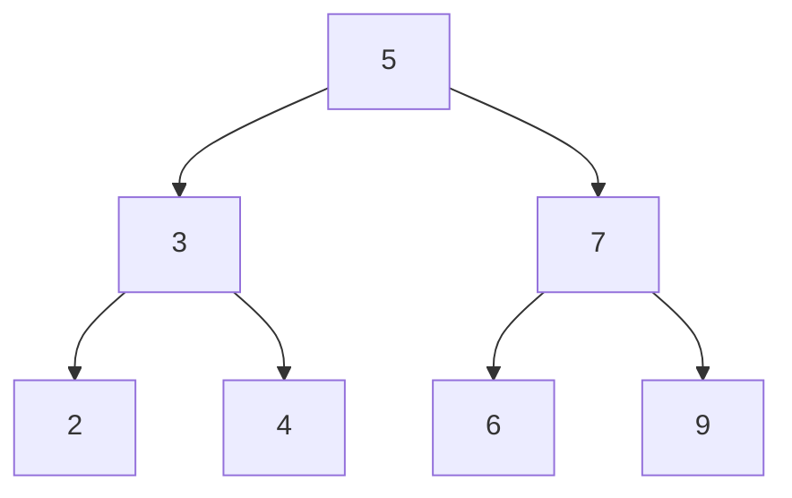

# Question
Given a binary tree of integers, print it in level order. The output will contain space between the numbers in the same level, and new line between different levels. For example, if the tree is:

The output should be: 

    5 
    3 7 
    2 4 6 9
# Answer
### method 1
```python
from collections import deque
def levelorder(root):

    queue = deque([root])
    current = 1
    next = 0

    while len(queue) != 0:
        node = queue.popleft()
        current -= 1
        print(node.value, end=' ')
        if node.leftChild:
            queue.append(node.leftChild)
            next += 1
        if node.rightChild:
            queue.append(node.rightChild)
            next += 1
        if current == 0:
            current, next = next, current
            print()

```

### method 2
```python
```

### method 3
```python
```
### testing

```python
```
