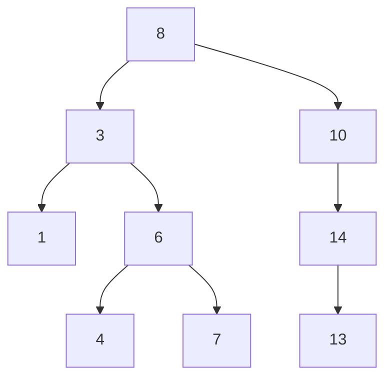
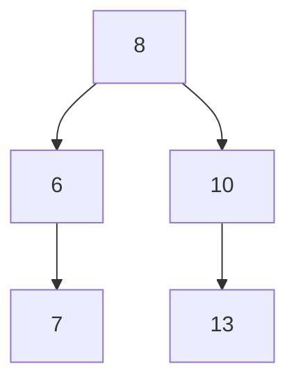

# Question
Given the root of a binary search tree and 2 numbers min and max, trim the tree such that all the numbers in the new tree are between min and max (inclusive). The resulting tree should still be a valid binary search tree. So, if we get this tree as input:

The output should be:

# Answer
### method 1
```python
def trim(root, min, max):
    if root is None:
        return None

    if root.value < min:
        return trim(root.right, min, max)

    if root.right > max:
        return trim(root.left, min, max)

    root.left = trim(root.left, min, max)
    root.right = trim(root.right, min, max)

    return root
```
<!--
### method 2
```python
```

### method 3
```python
```
### testing

```python
```

